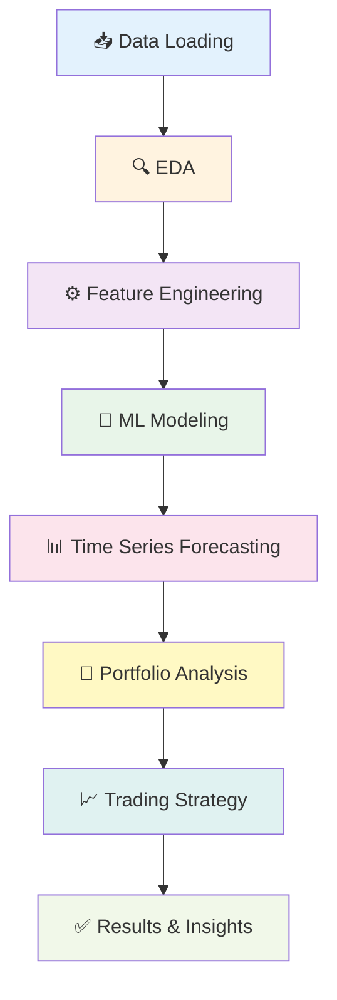

<div align="center">

# 📈 Stock Price Analysis & Prediction System

[](https://python.org)
[](https://colab.research.google.com/)
[](https://pandas.pydata.org/)
[](https://scikit-learn.org/)

### *Machine Learning-Powered Financial Analysis & Trading Strategy*

---

</div>

## 📌 Project Overview

A comprehensive **stock price analysis and prediction system** built in Python that leverages historical data and advanced time-series features to understand, model, and forecast stock market behavior.

<table>
<tr>
<td width="50%">

### 🎯 **What It Does**
- Analyzes price behavior & volatility
- Engineers time-series features
- Builds ML prediction models
- Simulates trading strategies

</td>
<td width="50%">

### 💡 **Why It Matters**
- Data-driven investment decisions
- Quantifiable risk assessment
- Automated trading insights
- Real-world financial modeling

</td>
</tr>
</table>

> **Primary Objective:** Understand how previous day information and price movements influence future stock prices, and build robust predictive models aligned with real-world financial data behavior.

---

## 🎯 Problem Statement

Given **historical stock price data**, this project aims to:

```yaml
Objectives:
  ✓ Analyze price behavior and volatility patterns
  ✓ Engineer meaningful time-series features
  ✓ Build machine learning models for price prediction
  ✓ Evaluate model performance using financial metrics
  ✓ Simulate trading strategy vs Buy & Hold baseline
```

---

## 🧠 Key Assumptions

<div align="center">

| Assumption | Rationale |
|------------|-----------|
| **📊 Historical Patterns Matter** | Past price movements contain predictive signals |
| **🔄 Previous Day Influence** | Stock prices are primarily influenced by recent trends |
| **🎯 Simplified Model** | External macro factors intentionally excluded for clarity |
| **📈 Time-Series Validity** | Historical data provides meaningful forecasting foundation |

</div>

---

## 🛠️ Technology Stack

<div align="center">


</div>

### 📦 **Core Libraries**

| Library | Purpose |
|---------|---------|
| **Pandas** | Data manipulation & time-series handling |
| **NumPy** | Numerical computations |
| **Matplotlib & Seaborn** | Data visualization |
| **Scikit-learn** | Machine learning models & evaluation |
| **Statsmodels** | ARIMA time-series forecasting |

---

## 📂 Dataset Description

### 📊 **StockPrice.csv**

```
┌────────────┬─────────┐
│   Column   │  Type   │
├────────────┼─────────┤
│ Date       │ datetime│  → Trading date
│ Price      │ float   │  → Closing stock price
└────────────┴─────────┘
```

**Data Preparation:**
- ✅ Converted to proper datetime format
- ✅ Sorted chronologically
- ✅ Missing values handled with time-series safe techniques
- ✅ Validated for temporal consistency

---

## 🔍 Project Workflow

<div align="center">



</div>

---

### 1️⃣ **Data Loading & Preparation**

```python
# Key Steps:
✓ Date column conversion to datetime
✓ Chronological sorting
✓ Missing value imputation (time-series safe)
✓ Data validation and quality checks
```

### 2️⃣ **Exploratory Data Analysis (EDA)**

<table>
<tr>
<td>

**📊 Analysis Performed:**
- Price trend visualization
- Distribution analysis
- Volatility assessment
- Statistical summaries

</td>
<td>

**🔍 Insights Generated:**
- Market regime detection
- Long-term growth patterns
- Price movement characteristics
- Risk & volatility profiles

</td>
</tr>
</table>

### 3️⃣ **Feature Engineering**

Created predictive features to capture **momentum, trend, and volatility:**

```yaml
Engineered Features:
  - Daily Price Changes: Δ Price
  - Percentage Returns: (Price_t - Price_t-1) / Price_t-1
  - Rolling Statistics: Moving averages, standard deviations
  - Lag Features: Price_t-1, Price_t-2, ... (time dependency)
  - Momentum Indicators: Trend strength measures
```

> 💡 These features help ML models understand temporal patterns and market dynamics

### 4️⃣ **Predictive Modeling**

#### 🤖 **Models Trained:**

<div align="center">

| Model Type | Examples | Best For |
|------------|----------|----------|
| **Linear Models** | Linear Regression, Ridge, Lasso | Baseline & interpretability |
| **Regularized Models** | ElasticNet, Ridge Regression | Preventing overfitting |
| **Ensemble Models** | Random Forest, Gradient Boosting | Capturing complex patterns |

</div>

#### 📊 **Evaluation Metrics:**

```
Performance Measures:
├── MSE (Mean Squared Error)      → Penalizes large errors
├── MAE (Mean Absolute Error)     → Average prediction error
└── R² (R-squared)                → Variance explained
```

> 🏆 **Best model selected** based on generalization performance on unseen test data

### 5️⃣ **Time Series Forecasting**

```
ARIMA Model Implementation:
├── Auto-Regressive (AR) component  → Uses past values
├── Integrated (I) component        → Handles non-stationarity
└── Moving Average (MA) component   → Uses past forecast errors

Purpose: Capture trend and autocorrelation behavior
Comparison: ML predictions vs classical time-series forecasting
```

### 6️⃣ **Portfolio Performance Analysis**

#### 💼 **Key Financial Metrics:**

<table>
<tr>
<th>Metric</th>
<th>Formula/Description</th>
<th>Interpretation</th>
</tr>
<tr>
<td>📈 Total Return</td>
<td>(Final - Initial) / Initial</td>
<td>Overall profit/loss</td>
</tr>
<tr>
<td>📊 Annualized Return</td>
<td>Geometric mean return × 252</td>
<td>Yearly performance</td>
</tr>
<tr>
<td>📉 Volatility</td>
<td>Std dev of daily returns</td>
<td>Risk measure</td>
</tr>
<tr>
<td>⚖️ Sharpe Ratio</td>
<td>(Return - Risk-free) / Volatility</td>
<td>Risk-adjusted return</td>
</tr>
<tr>
<td>🔻 Max Drawdown</td>
<td>Peak-to-trough decline</td>
<td>Worst loss period</td>
</tr>
</table>

> 🎯 Provides a **risk-adjusted view** of market performance

### 7️⃣ **Trading Strategy Simulation**

#### 📈 **Moving Average Crossover Strategy**

<div align="center">

```ascii
Strategy Logic:
┌─────────────────────────────────────────────┐
│  Short-term MA (20-day) vs Long-term MA (50-day) │
├─────────────────────────────────────────────┤
│  🟢 BUY Signal:  MA_20 crosses ABOVE MA_50  │
│  🔴 SELL Signal: MA_20 crosses BELOW MA_50  │
└─────────────────────────────────────────────┘
```

</div>

#### 🏆 **Performance Comparison:**

**Strategy vs Buy & Hold:**

| Metric | Evaluated |
|--------|-----------|
| 💰 Total Returns | Which performs better? |
| ⚖️ Sharpe Ratio | Risk-adjusted comparison |
| 📉 Drawdown | Maximum loss analysis |
| 🎯 Win Rate | % of profitable trades |
| 🔄 Number of Trades | Trading frequency |

#### 📊 **Visualizations Generated:**

```
1. Price Chart with Buy/Sell Signals
   └── Visual representation of strategy execution

2. Cumulative Returns Comparison
   └── Strategy vs Buy & Hold over time

3. Returns Distribution
   └── Statistical analysis of trade outcomes
```

---

## 📊 Key Results & Insights

<div align="center">

### 🎯 **Major Findings**

</div>

```diff
+ Stock prices exhibit strong trend persistence and momentum behavior
+ Machine learning models effectively capture price movement patterns
+ Ensemble models generally outperform simple linear models
+ Trading strategies can outperform Buy & Hold in certain market regimes
+ Volatility and drawdowns are critical for risk management
```

### 💡 **Performance Highlights:**

<table>
<tr>
<td>

**🤖 Model Performance:**
- ML models capture non-linear patterns
- Feature engineering significantly improves accuracy
- Ensemble methods provide robust predictions

</td>
<td>

**📈 Strategy Performance:**
- Moving averages effectively identify trends
- Strategy reduces exposure during downturns
- Risk-adjusted returns competitive with Buy & Hold

</td>
</tr>
</table>

---

## ✅ Conclusions

<div align="center">

| Finding | Implication |
|---------|-------------|
| **Historical Features Work** | Past price data contains predictive signals |
| **ML + Time-Series = Powerful** | Combining approaches yields deeper insights |
| **Simple Strategies Effective** | Moving averages are interpretable and actionable |
| **Framework is Extensible** | Easy to add new features or assets |

</div>

---

## 🚀 Future Enhancements

### 🔮 **Planned Features:**

- [ ] **📊 Macroeconomic Indicators** - GDP, interest rates, inflation
- [ ] **🧠 Deep Learning Models** - LSTM, GRU networks for sequential patterns
- [ ] **💼 Multi-Asset Portfolios** - Diversification across stocks, bonds, commodities
- [ ] **🔄 Walk-Forward Validation** - Simulate live market conditions
- [ ] **📱 Real-Time Data Integration** - Live market data feeds
- [ ] **🎯 Sentiment Analysis** - News and social media sentiment
- [ ] **🔔 Alert System** - Automated trading signal notifications

---

## ▶️ How to Run

### 🚀 **Quick Start**

#### 1️⃣ **Open Google Colab**

```
🌐 Navigate to: https://colab.research.google.com/
```

#### 2️⃣ **Upload Dataset**

```python
# Upload StockPrice.csv to Colab
from google.colab import files
uploaded = files.upload()
```

#### 3️⃣ **Install Dependencies** (if needed)

```bash
!pip install pandas numpy matplotlib seaborn scikit-learn statsmodels
```

#### 4️⃣ **Run the Notebook**

```python
# Execute all cells or run main function
main()
```

#### 5️⃣ **View Results**

The notebook will automatically generate:

```
✅ Comprehensive Analysis
✅ Trained ML Models
✅ Time-Series Forecasts
✅ Trading Strategy Results
✅ Performance Visualizations
```

---

## 📁 Project Structure

```
stock-price-analysis/
│
├── 📓 stock_analysis.ipynb       # Main Colab notebook
├── 📊 StockPrice.csv              # Historical stock data
├── 📄 README.md                   # Project documentation
│
├── 📂 outputs/                    # Generated results
│   ├── models/                    # Saved ML models
│   ├── predictions/               # Forecast outputs
│   └── visualizations/            # Charts & plots
│
└── 📂 docs/                       # Additional documentation
    ├── methodology.md
    └── results_analysis.md
```

---

## 📌 Author Notes

This project demonstrates:

<table>
<tr>
<td>

**💻 Technical Skills:**
- Strong Python fundamentals
- ML & time-series expertise
- Financial domain knowledge
- Clean, modular code

</td>
<td>

**🎯 Practical Application:**
- Real-world financial modeling
- Production-style implementation
- Clear data interpretation
- Actionable trading insights

</td>
</tr>
</table>

---

## 🤝 Contributing

Contributions are welcome! Areas for improvement:

```
├── Additional ML models (XGBoost, LightGBM, Neural Networks)
├── More sophisticated trading strategies
├── Enhanced feature engineering techniques
├── Real-time data pipeline integration
├── Risk management improvements
└── Interactive dashboard development
```

**How to Contribute:**

```bash
1. Fork the repository
2. Create feature branch:  git checkout -b feature/NewFeature
3. Commit changes:         git commit -m 'Add NewFeature'
4. Push to branch:         git push origin feature/NewFeature
5. Open Pull Request
```

---

## 📄 License

This project is open-source and available under the **MIT License**.

---

## ⚠️ Disclaimer

<div align="center">

### 🚨 **Investment Disclaimer**

**This project is for educational and research purposes only.**

```diff
! NOT FINANCIAL ADVICE
  This tool does not constitute financial or investment advice

! PAST PERFORMANCE ≠ FUTURE RESULTS
  Historical patterns do not guarantee future outcomes

! USE AT YOUR OWN RISK
  Trading involves substantial risk of loss
```

**Always consult with qualified financial professionals before making investment decisions.**

</div>

---

## 📚 Additional Resources

<table>
<tr>
<td align="center">

**📖 Documentation**  
[Project Wiki](#)

</td>
<td align="center">

**📊 Sample Results**  
[View Outputs](#)

</td>
<td align="center">

**🎥 Tutorial Video**  
[Watch Demo](#)

</td>
</tr>
</table>

---

## 📞 Contact & Support

<div align="center">

[](../../issues)
[](mailto:your.email@example.com)

</div>

**For questions, bug reports, or feature requests:**
- 📋 Check [existing issues](../../issues)
- ✉️ Create a new issue with details
- 📧 Email for direct inquiries

---

<div align="center">

### Made with 📊 for quantitative finance enthusiasts

⭐ **If you find this project useful, please give it a star!**


---

*"In God we trust, all others must bring data." - W. Edwards Deming*

</div>
